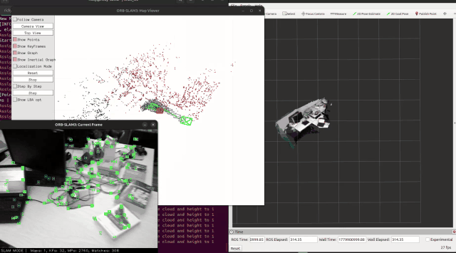

<p align="center">
  
  
</p>

<h1 align="center">ORB-SLAM3-Dense-ROS2</h1>

<p align="center">
  <a href="README_EN.md">English</a> ·
  <a href="README_CH.md">中文</a>
</p>

This package is a ROS 2 wrapper for the sibling [`dense_orbslam3`](../../dense_orbslam3/README.md) repository. `dense_orbslam3` builds the modified ORB-SLAM3 core, dense mapping code, vocabulary, camera configs, and point-cloud tools. This repository provides ROS 2 nodes that use that core and publish dense point clouds or OctoMap maps. Remote core repository: [Pplll-pppl/Dense_OrbSlam3](https://github.com/Pplll-pppl/Dense_OrbSlam3).

## Repository Layout

Recommended layout:

```text
<ws>/
  dense_orbslam3/              # ORB-SLAM3 core, libORB_SLAM3.so, configs, datasets
  src/orbslam3_dense_ros2/     # this ROS 2 package
```

Replace every example path with your own `<ws>`. The current `CMakeLists.txt` expects `dense_orbslam3` at `<ws>/dense_orbslam3`; if you move it, update `DENSE_ORBSLAM3_ROOT`, `OpenCV_DIR`, and `PCL_DIR`.

## Important Files From `dense_orbslam3`

| Path | Purpose |
|------|---------|
| `<ws>/dense_orbslam3/lib/libORB_SLAM3.so` | ORB-SLAM3 library linked by this ROS 2 package |
| `<ws>/dense_orbslam3/Vocabulary/ORBvoc.txt` | ORB vocabulary file required at runtime |
| `<ws>/dense_orbslam3/Examples/RGB-D/*.yaml` | Camera settings, for example `TUM1.yaml` or `RealSense_D435i.yaml` |
| `<ws>/dense_orbslam3/Examples/RGB-D/associations/*.txt` | TUM RGB-D timestamp association files |
| `<ws>/dense_orbslam3/dataset/TUM-RGBD/<sequence>` | Optional TUM dataset folders |
| `<ws>/dense_orbslam3/Examples/RGB-D/PointCloudMapping_RGBD.pcd` | Example dense point cloud output, useful for PCD-to-OctoMap |
| `<ws>/dense_orbslam3/3rdParty/...` | Built OpenCV, PCL, Pangolin dependencies used by this package |

Dataset folders can live elsewhere; just pass their absolute path to the node.

## Build

Build `dense_orbslam3` first:

```bash
cd <ws>/dense_orbslam3
chmod +x build.sh
./build.sh
```

Then build this ROS 2 package:

```bash
cd <ws>
colcon build --packages-select orbslam3_dense_ros2
source install/setup.bash
```

## Nodes

| Node | Role |
|------|------|
| `orb_slam3_main` | Real RGB-D camera input to ORB-SLAM3 dense mapping |
| `rgbd_dataset_dense_node` | Plays TUM RGB-D or `rgb/` + `depth/` folder datasets |
| `octomap_converter` | Converts `/orb_slam3/dense_points` to OctoMap |
| `pcd_to_octomap_node` | Converts a saved `.pcd` file to OctoMap |

Main topics:

| Topic | Type | Meaning |
|-------|------|---------|
| `/orb_slam3/dense_points` | `sensor_msgs/PointCloud2` | Dense RGB point cloud from ORB-SLAM3 |
| `/orb_slam3/octomap` or `/octomap` | `octomap_msgs/Octomap` | Converted OctoMap output |

## Run With RealSense RGB-D

```bash
source <ws>/install/setup.bash

ros2 run orbslam3_dense_ros2 orb_slam3_main \
  <ws>/dense_orbslam3/Vocabulary/ORBvoc.txt \
  <ws>/dense_orbslam3/Examples/RGB-D/RealSense_D435i.yaml \
  true \
  /camera/camera/color/image_raw \
  /camera/camera/aligned_depth_to_color/image_raw \
  true
```

In another terminal:

```bash
source <ws>/install/setup.bash
ros2 run orbslam3_dense_ros2 octomap_converter
```

Open RViz2 and view `/orb_slam3/dense_points` and the OctoMap topic.

## Run With TUM RGB-D Dataset

```bash
source <ws>/install/setup.bash

ros2 run orbslam3_dense_ros2 rgbd_dataset_dense_node \
  --voc <ws>/dense_orbslam3/Vocabulary/ORBvoc.txt \
  --param <ws>/dense_orbslam3/Examples/RGB-D/TUM1.yaml \
  --tum <ws>/dense_orbslam3/dataset/TUM-RGBD/rgbd_dataset_freiburg1_room:<ws>/dense_orbslam3/Examples/RGB-D/associations/fr1_room.txt \
  --viewer true \
  --dense-mode realtime
```

For a simple dataset folder, use a root directory containing `rgb/` and `depth/`:

```bash
ros2 run orbslam3_dense_ros2 rgbd_dataset_dense_node \
  --voc <ws>/dense_orbslam3/Vocabulary/ORBvoc.txt \
  --param <ws>/dense_orbslam3/Examples/RGB-D/TUM1.yaml \
  --root_dir /absolute/path/to/rgbd_dataset \
  --viewer true \
  --dense-mode realtime
```

Dense modes:

| Mode | Meaning |
|------|---------|
| `realtime` | Publish dense clouds while new keyframes arrive |
| `deferred` | Rebuild dense map after playback using optimized Atlas keyframes |
| `both` | Do both realtime and final rebuild |

## Convert PCD To OctoMap

```bash
source <ws>/install/setup.bash

ros2 run orbslam3_dense_ros2 pcd_to_octomap_node --ros-args \
  -p pcd_file:=<ws>/dense_orbslam3/Examples/RGB-D/PointCloudMapping_RGBD.pcd \
  -p topic_name:=/octomap \
  -p resolution:=0.05
```

Use any `.pcd` path if your point cloud is stored elsewhere.

## Common Parameters

| Parameter | Default | Used by |
|-----------|---------|---------|
| `dense_build_mode` | `realtime` or `deferred` | Dense nodes |
| `dense_resolution` | `0.01` / `0.008` | Dense voxel filter |
| `dense_unit` | `5000.0` | TUM 16UC1 depth scale |
| `dense_pointcloud_topic` | `/orb_slam3/dense_points` | Dense cloud publisher |
| `input_pointcloud_topic` | `/orb_slam3/dense_points` | `octomap_converter` |
| `pcd_file` | empty | `pcd_to_octomap_node` |
| `resolution` | `0.05` | OctoMap resolution |

## Troubleshooting

- Build `dense_orbslam3` before this package; this package links against its `libORB_SLAM3.so`.
- If paths fail, replace `<ws>` with your own workspace path and check `CMakeLists.txt`.
- If PCL/OpenCV conflicts appear, use the versions built under `dense_orbslam3/3rdParty`.
- In RViz2, use `map` as the fixed frame unless your launch changes the frame.

## License

This project is based on ORB-SLAM3 and follows its original GPLv3 license.
